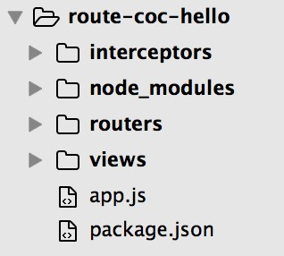

# 开始使用
建立项目目录并安装
`
take route-coc-hello # 创建目录并进入
npm init # 初始化一个工程
npm install route-coc --save # 安装route-coc并保存
`
route-coc是基于express.js构建的，并且添加了express.js依赖，所以不需要另外单独安装express.js。

建立约定的相关目录：router配置、interceptor配置、view配置，创建启动文件app.js, 之后目录如下图所示：

