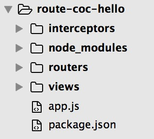
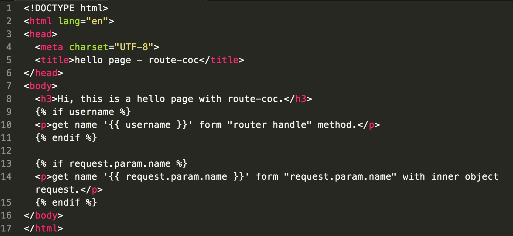

## 开始使用
1. **建立项目目录并安装**
```
take route-coc-hello # 创建目录并进入
npm init # 初始化一个工程
npm install route-coc --save # 安装route-coc并保存
```
route-coc是基于express.js构建的，并且添加了express.js依赖，所以不需要另外单独安装express.js。

2. **建立约定的相关配置目录：routers、interceptors、views，创建启动文件app.js, 之后目录如下图所示：**

  

3. **在app.js中添加如下代码**

  ```
  const express = require('express');
  const coc = require('route-coc');
  const log = require('t-log');

  const app = express();
  const stage = coc(app);

  const port = 8080;
  app.listen(port, () => {
    const startInfo = `server run at http:\/\/localhost:${port}`;

    log.info(startInfo);
  });
  ```

4. **运行node app.js**。

   即可启动一个暂无任何路由配置的server。<br>当然暂无任何功能。
   
5. **添加view和router配置。**

   在routers目录下建立hello.js, views目录下建立hello.njk。

  hello.js写入以下路由配置：

  ```
  module.exports = {
    '/hello, /hello/:name': {
      'get': {
        handle(data, req) {
          return {
            'username': req.param.name
          };
        },
        view: 'hello'
      }
    }
  };
  ```

  hello.njk写入以下内容：
  

6. **OK! 再次启动app: node app.js，分别访问：**
http://localhost:8080/hello<br>
http://localhost:8080/hello/lily
<br>看看页面呈现吧。 

####备注：
* route-coc本质是express的middleware实现，因此express本身的各种API也可以使用。
* 以上代码可以在 <https://github.com/tofishes/route-coc-hello/tree/master/code> 找到。
